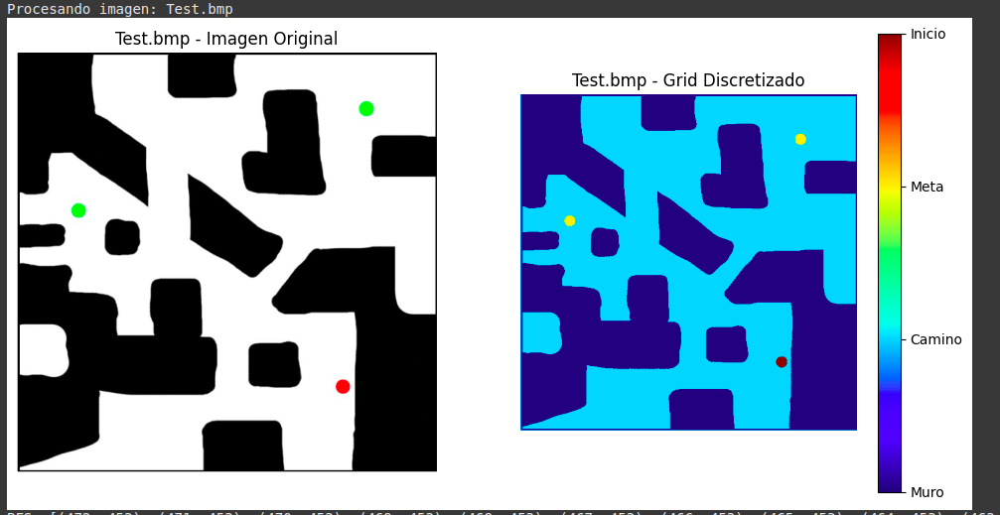
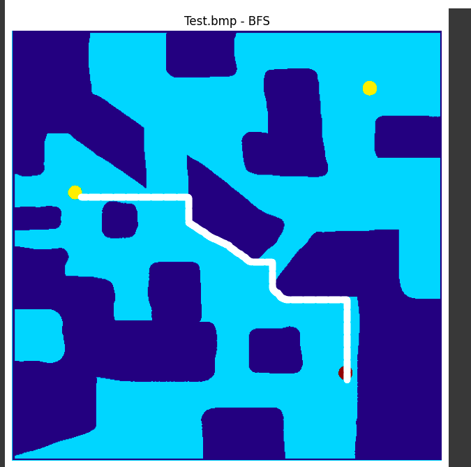
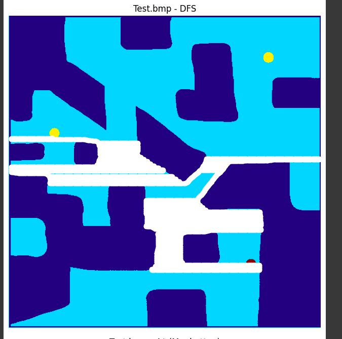
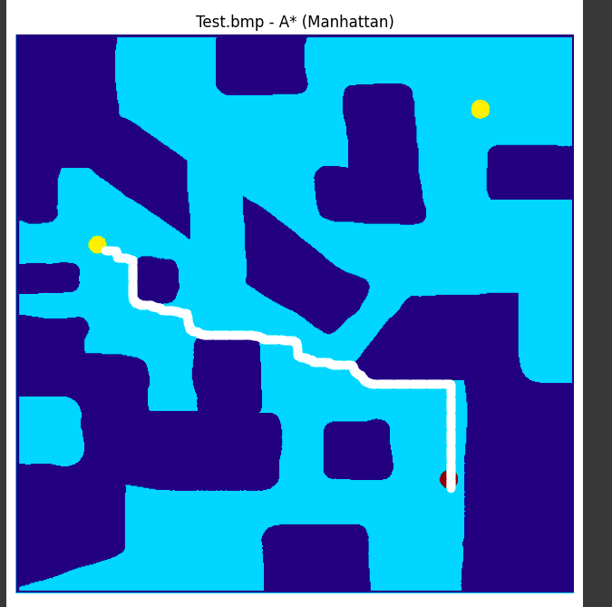
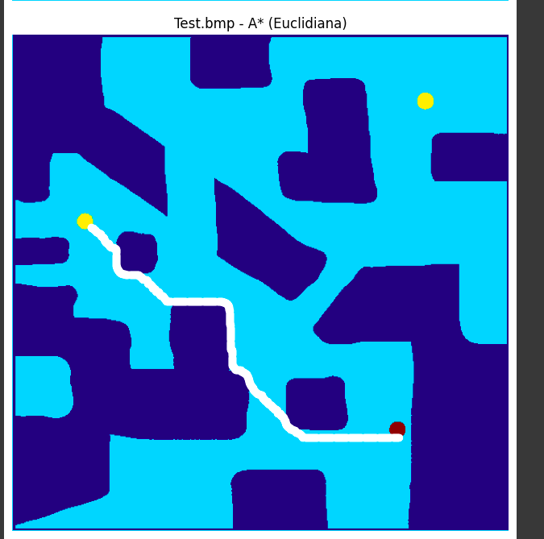

# Graph Search - Laberinto Solver

Este proyecto implementa algoritmos de búsqueda en grafos para resolver laberintos representados como imágenes. Se utilizan técnicas de discretización de imágenes para convertir el laberinto en una matriz numérica y luego se aplican algoritmos de búsqueda para encontrar un camino desde un punto de inicio hasta una meta.

---

## 1. Instalación y Requisitos

Para ejecutar este proyecto, asegúrese de tener instaladas las siguientes bibliotecas:

```sh
pip install numpy opencv-python matplotlib
```

---

## 2. Funcionamiento del Programa

### 2.1 Discretización de la Imagen

Se recibe una imagen cuadrada en formato PNG o BMP y se convierte en una matriz discreta:
- **Blanco**: Camino libre.
- **Negro**: Pared.
- **Rojo**: Punto de inicio (único).
- **Verde**: Meta (puede haber varias).

Código relevante:
```python
def discretizar_imagen(nombre_archivo, cell_size=1, umbral=127, invertir_umbral=False):
    # Leer imagen y convertir a matriz discreta
```

---

### 2.2 Representación del Problema (POO)

Se implementa una clase abstracta `Problem` para definir la estructura del problema, y `LaberintoProblem` para modelar el problema del laberinto.

```python
class LaberintoProblem(Problem):
    def __init__(self, grid):
        # Inicialización del problema con matriz discreta
```

---

### 2.3 Algoritmos de Búsqueda

Se implementan los siguientes algoritmos de búsqueda:
- **BFS (Breadth-First Search)**: Explora todos los nodos en cada nivel antes de descender.
- **DFS (Depth-First Search)**: Explora en profundidad antes de retroceder.
- **A* con heurísticas:**
  - Distancia de Manhattan.
  - Distancia Euclidiana.

Ejemplo de implementación de BFS:
```python
def breadth_first_search(problem):
    # Implementación del algoritmo BFS
```

---

### 2.4 Visualización de Resultados

Se muestra la imagen original, el grid discretizado y los caminos encontrados.

```python
def mostrar_resultados(nombre, img, grid, camino_dict):
    # Generación de imágenes con matplotlib
```

---

## 3. Ejecución del Programa

Para ejecutar el programa, se procesan diferentes imágenes:
```python
nombres = ["Test.bmp", "Test2.bmp", "turing.bmp"]
for nombre in nombres:
    # Cargar y procesar imágenes
```

---

## 4. Resultados

A continuación, se presentan los resultados obtenidos con las imágenes procesadas. Se muestran los caminos encontrados por cada algoritmo:

### 4.1 Imagen de entrada y Grid Discretizado



### 4.2 Caminos encontrados

- **BFS**
  

- **DFS**
  

- **A* (Manhattan)**
  

- **A* (Euclidiana)**
  

---

## 5. Conclusiones

- **BFS** garantiza el camino más corto pero puede consumir más memoria.
- **DFS** puede encontrar caminos rápidamente, pero no garantiza la solución óptima.
- **A*** con heurísticas de Manhattan y Euclidiana ofrece una mejor exploración y optimización.

Este proyecto demuestra cómo se pueden aplicar algoritmos de búsqueda en grafos para resolver problemas del mundo real, como la navegación en laberintos.

